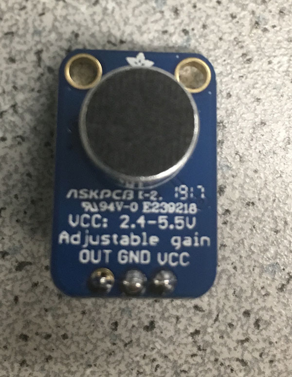
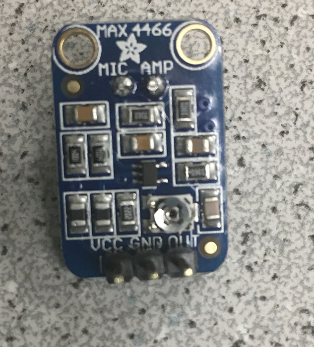
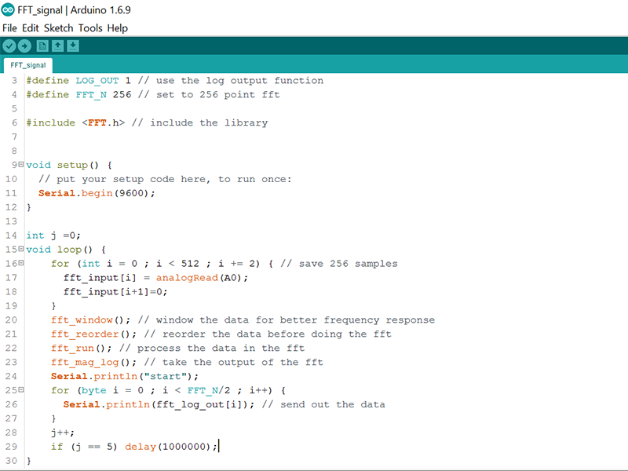
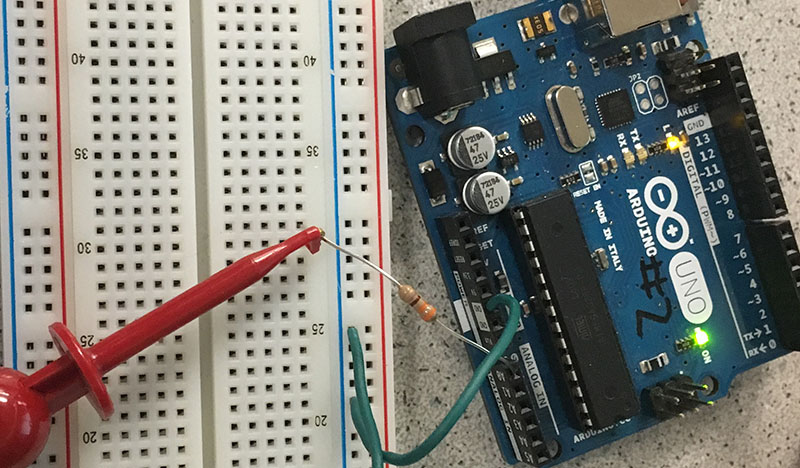
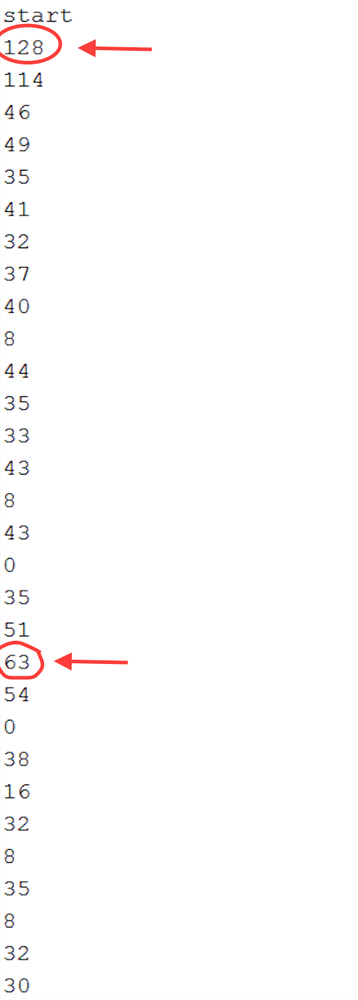
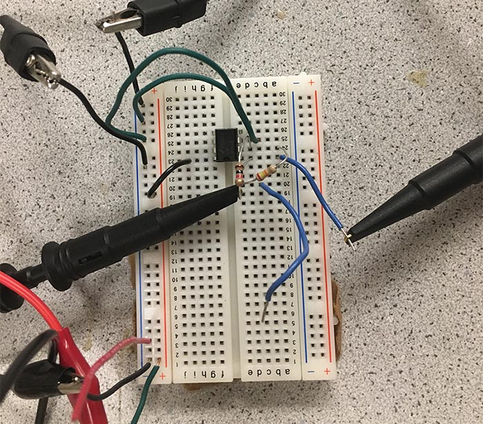
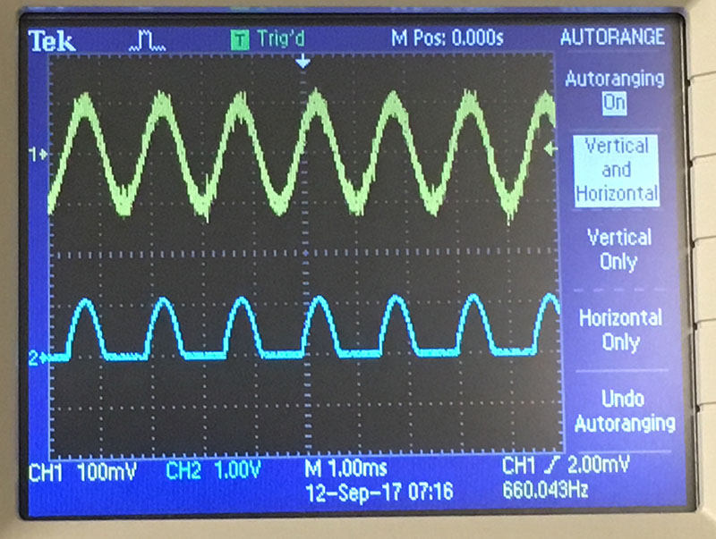
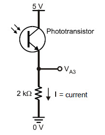
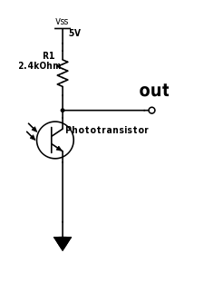

# Lab 2

## Goals:
The goal of the Audio subteam was to build a microphone circuit that will detect a 660Hz whistle blow signifying the beginning of your maze mapping. The microphone should be able to detect the starting signal despite excessive background noise (There will be an emergency start button just in case!)

The goal of the Optical subteam was to receive and categorize IR signals of varying frequencies from a treasure circuit. What factors go into locating the treasure during actual operation should be considered.

## Sub- teams:
### Optical 
1. JinJie Chen; Kenneth Huaman; Adrian Higgins Dohmann
### Audio
2. Amanda Pathmanathan; Khyati Sipani; Sanush Nukshan Kehelella

## Lab Procedure

### Audio
We started off by soldering some pins to our microphone in order to place it on the breadboard. 

       

From our Prelab, we discovered that AnalogRead would be sufficient for sampling a 660 Hz signal. From [Show Info](https://playground.arduino.cc/Main/ShowInfo), we figured that AnalogRead takes 111.987 microseconds, giving a sampling frequency of 1/.000111987 = ~8930Hz. This would be sufficient to read a signal at 660Hz (since our sampling frequency needs to be at least 2x660!) The ADC would be better for the Optical subteam since they need to detect signals of around 7-17kHZ!

We wrote our FFT code using AnalogRead() as below: 

To test our code first, we used the function generator to generate a 660 Hz signal (the one that we would be detecting) instead of the online tone generator The function generator was connected to A0 with a 300 ohm resistor in series. Here is a picture of our circuit:

Our results from the serial monitor for the function generator: 

The peak values kept appearing in both the 1st and 20th! Since our sampling frequency was 8930 Hz, and we took 256 samples, each bin would be 8930/256 = 34.9 Hz wide. Hence the 20th bin would have range 663 - 698 Hz, and it makes sense to see a peak in the 20th bin. However, we were unable to understand the peak in the first bin. The value for the second bin also seemed really high.

We then generated a 660 Hz tone using an [online tone generator](http://www.szynalski.com/tone-generator/). After connecting the circuit to the microphone instead of the function generator, we again saw a spike in the 1st, 2nd, and 20th bin: 

Our results from the serial monitor for the microphone signal: 

The peak in the 20th bin means our FFT code is working. But we have peaks in the 1st and 2nd bins as well - it probably has something to do with the circuit or breadboard. When forming the code for detecting the start signal later on, we can ignore the value in the first two bins if the peaks keeps on appearing.

We also tried assembling the circuit for a non-inverting opamp since the signal may not be as clear during the actual competition. We didn't need one for the lab as we were able to detect peaks. Here is how far we got during lab:

Results on the oscilloscope:

### Optical
The treasure circuit, once given a battery and turned on, had settings to optimize frequency and intensity of the IR light.
The FFT algorithm was used from ..........
Using the FFT, the spectral decomposition of several treasure frequencies was recorded
The lab handout detailed the photoresistor be connected as the left diagram below, but in accordance with the advice of the TA and team alpha, it was changed to the diagram below to the right.

                  

The full circuit including the connection to the Analog-0 port of the Arduino can be seen below.

To set up a test of the circuit, the oscilloscope was used to measure the output of the photoresistor when the treasure sensor was 3cm away. The treasure sensor was calibrated to roughly 7kHz by directly connecting to the oscilloscope prior and the intensity was turned up to half. The output from the oscilloscope when connected to the photoresistor picked up 7.123kHz.

The the magnitude of the received signal dies off with distance. For future tests, an active filter will most likely be necessary to amplify a certain range or ranges of frequency, especially considering the variablility of the intensity and the ambient noise contributions that would otherwise mask. Given the list of possible frequencies for the treasure, the corresponding FFTs of the received signal were captured and superimposed as seen below.

All spectra had a strong DC component along with significant low frequency contribution, of which a high pass filter would help ignore. The tentative design is: 

