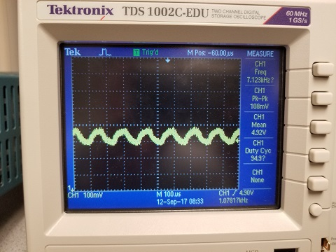
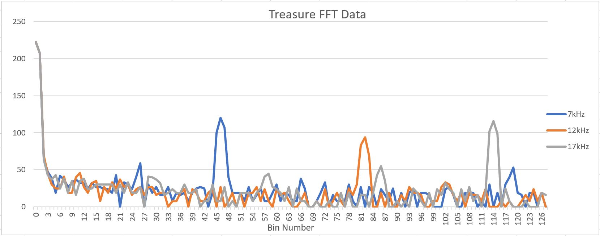

# Lab 2
(VERY ROUGH ATTEMPT< FEEL FREE TO EDIT
## Goal
To implement the filter

## Sub- team
1. JinJie Chen; Kenneth Huaman; Adrian Higgins Dohmann
2. Amanda Pathmanathan; Khyati Sipani; Sanush Nukshan Kehelella

## Lab Procedure

### Audio

### Optical
The treasure circuit, once given a battery and turned on, had settings to optimize frequency and intensity of the IR light.
The FFT algorithm was used from ..........
Using the FFT, the spectral decomposition of several treasure frequencies was recorded
The lab handout detailed the photoresistor be connected as the left diagram below, but in accordance with the advice of the TA and team alpha, it was changed to the diagram below to the right.

                  
The full circuit including the connection to the Analog0 port of the Arduino can be seen below.

To set up a test of the circuit, the oscilloscope was used to measure the output of the photoresistor when the treasure sensor was 3cm away. The treasure sensor was calibrated to roughly 7kHz by directly connecting to the oscilloscope prior and the intensity was turned up to half. The output from the oscilloscope when connected to the photoresistor picked up 7.123kHz.

The the magnitude of the received signal dies off with distance. For future tests, an active filter will most likely be necessary to amplify a certain range or ranges of frequency, especially considering the variablility of the intensity and the ambient noise contributions that would otherwise mask. Given the list of possible frequencies for the treasure, the corresponding FFTs of the received signal were captured and superimposed as seen below.

