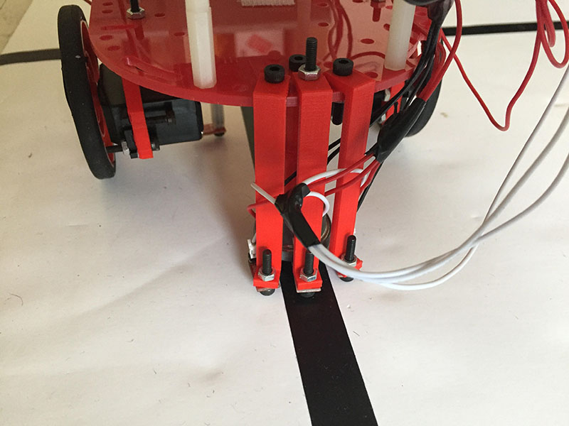
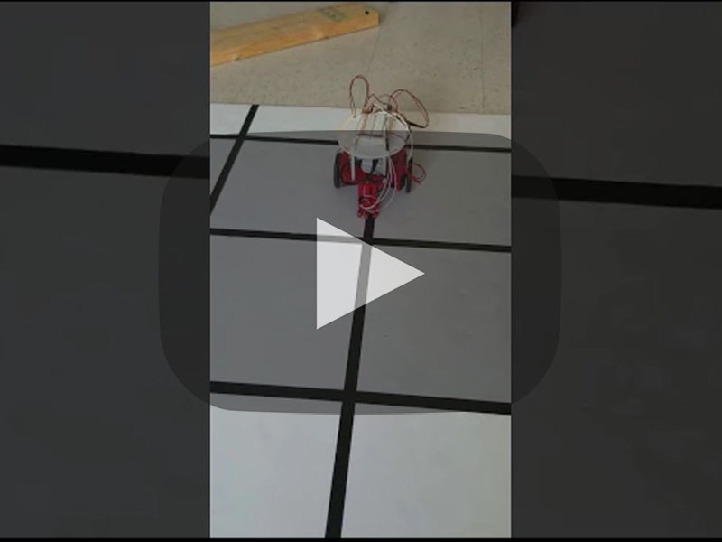
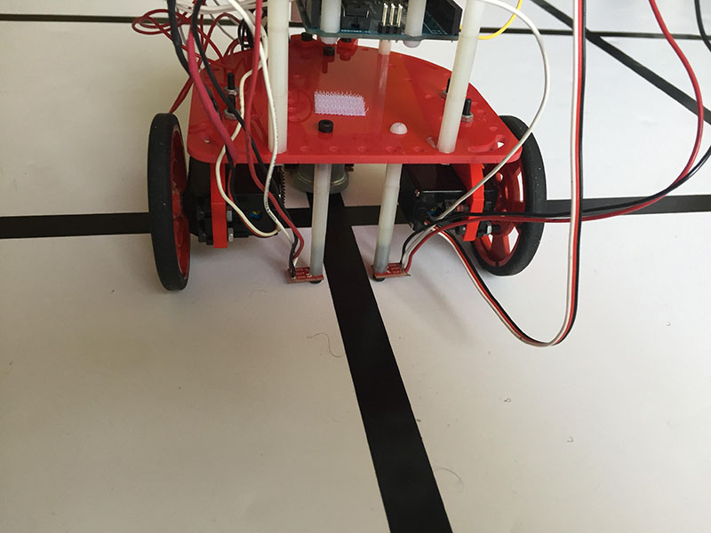

# Milestone 1

## Goal
The goal of this milestone was to add line tracking and grid traversing functionality to our robot, finally testing this by performing a figure 8.

## Lab Procedure
### Line Detection
We first tested the functionality of the QRE113 IR line sensors by holding them a few millimeters over black and white surfaces and observing their output. Using our measurements, we determined reasonable threshold values to determine whether a sensor is over a line.

We then attached 3 QRE113 IR line sensors to the front of our robot, spacing them so that only the center sensor would read a line when the robot is oriented perfectly straight. The other two sensors would read only when the robot has skewed in one direction. Their placement can be seen here:



With these sensors, our robot can detect whether it is positioned straight or at an angle over a line.

### Line Following
Our algorithm for following a line works as follows:
```C
if (middle sensor on black and left sensor on white and right sensor on white){ //robot is going straight
  forward
} else if (middle sensor on black and left sensor on black and right sensor on white){ //robot is angled slightly to the right
  adjust slight left //slow left servo slightly
} else if (middle sensor on black and left sensor on white and right sensor on black){ //robot is angled slightly to the left
  adjust slight right //slow right servo slightly
} else if (middle sensor on white and left sensor on black and right sensor on white){ //robot is angled strongly to the right
  adjust strong left //slow left servo strongly
} else if (middle sensor on white and left sensor on white and right sensor on black){ //robot is angled strongly to the left
  adjust strong right //slow right servo strongly
} else { //either sensors are over intersection, robot is entirely off line, or (impossibly) left and right are on but middle is off
  forward //keep going, either way it's better than stopping
}
```
Using the three line following sensors, our robot is not only able to detect if it is at an angle, but is also to detect whether it is at a strong or slight angle. This allows the robot to make adjustments of varying intensity depending on its situation. Because of this, the robot will not waste time by overadjusting to slight angles.

Putting this algorithm to the test, we found that the robot will successfully track a line even while being pushed slightly off course.

[](https://youtu.be/nTEPqP1qgJY)

### Intersection Detection, Turning, and Figure 8
We connected two additional QRE113 IR line sensors to the robot in order to detect when the robot has entered an intersection. The sensors are placed approximately an inch apart in line with the axis of the wheel, such that both sensors will read the line only when the wheels are over an intersection. Their placement can be seen here:



When both of the two rear line sensors read a black line, we know that the robot has entered an intersection and is positioned directly over the center. At this point, the robot can stop and do whatever it needs to (detect treasure, determine next movement, turn, etc.) before exiting the intersection again. For the sake of convenience, we created a methods "follow line until reaching an intersection" which will follow a line until detecting an intersection, at which point it stops.

Our turning algorithm works spinning both wheels in opposite directions and then stopping when the front middle sensor has arrived over a line again. At this point, the robot should have completed a 90 degree rotation in whichever direction it was set to spin and, even if it is slightly off center of the line, should be capable of tracking the line again from this point. The algorithm for our right turn looks like this:
```C
spin left wheel forward
spin right wheel backward
while (front middle sensor on black line) { //wait until the sensor leaves the black line that it (presumably) started on
  wait a few milliseconds
}
while (front middle sensor not on black line) { //wait until the sensor arrives on a black line again
  wait a few milliseconds
}
stop //turn is completed
```
We chose to create methods for "right turn," "left turn," "turn 180 degrees right," and "turn 180 degrees left," the latter two methods consisting of two of their respective turns.

To test our line tracking and turning algorithms, we strung together an ordered series of "turn" and "following line until reaching an intersection" commands to perform a figure 8. Our figure 8 was accoplished with the following set of instructions:
```C
follow line until intersection
turn right
follow line until intersection
follow line until intersection
turn left
follow line until intersection
turn left
follow line until intersection
turn left
follow line until intersection
follow line until intersection
turn right
follow line until intersection
turn right
```

Our robot's wonderful success can be seen chronicled in video below:

[](https://youtu.be/NfCRnDHCJfM)
